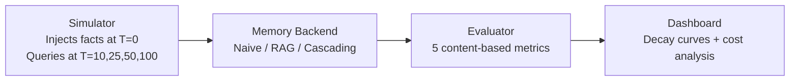

<div align="center">

# 🔭 MemoryLens

### *An Evaluation Framework for LLM Memory Decay*

**You can't improve what you can't measure. Nobody is measuring memory.**

[](https://github.com/Neal006/memorylens/actions/workflows/ci.yml)
[](https://www.python.org/)
[](LICENSE)
[](CONTRIBUTING.md)
[](https://github.com/Neal006/memorylens/stargazers)
[](https://github.com/Neal006/memorylens/network/members)

[**Quick Start**](#quick-start) • [**How It Works**](#how-it-works) • [**Results**](#benchmark-results) • [**Contributing**](#contributing) • [**Roadmap**](ROADMAP.md)

</div>

---

## The Problem

Every LLM application that runs multi-turn conversations has a memory system. Most developers just stuff the whole chat history into the context window and hope for the best.

But nobody asks the hard questions:

- **How much does the AI actually remember** after 10 conversations? After 100?
- **When does memory become noise** instead of signal?
- **Which architecture** retains the most useful context at the lowest token cost?

There is no reproducible, open benchmark that answers these questions. **MemoryLens is that benchmark.**

---

## Key Findings

Run `python quick_demo.py` and you'll get numbers like these (no API key needed):

| Backend | Recall @ T=100 | Tokens/Query | Monthly Cost* | Cascade Efficiency |
|---------|:--------------:|:------------:|:-------------:|:-----------------:|
| Naive (full history) | 62.5% | 1,189 | INR 9,869 | 1.0× baseline |
| RAG (semantic retrieval) | 100.0% | 58 | INR 481 | — |
| **Cascading Temporal** | **75.0%** | **261** | **INR 2,166** | **5.45×** |

> *At 100K queries/month. Cascading Temporal Memory delivers **5.45× more recall per token** than naive memory at T=100.*

**What these numbers mean in plain English:**
- By turn 100, naive memory has **forgotten 37.5% of facts** the user explicitly told it — because old messages get evicted when the context window fills up.
- RAG never forgets (100% recall) but treats all messages as equal — it has no sense of recency or temporal narrative.
- Cascading Temporal Memory is the middle ground: it keeps recent context verbatim, retrieves older context semantically, and compresses ancient context into summaries. At **78% lower cost than naive** with **+12.5pp better recall**.

---

## Quick Start

### Zero API key — runs in 60 seconds

```bash
git clone https://github.com/Neal006/memorylens.git
cd memorylens
pip install -r requirements.txt
python quick_demo.py
```

### Dashboard (interactive, still no API key needed)

```bash
streamlit run dashboard.py
# Click "📊 Demo" in the sidebar for instant results
```

### Live benchmark with real LLM evaluation

```bash
cp .env.example .env
# Add your free Groq API key from console.groq.com
python main.py --turns 100 --backends naive rag cascading --log
```

---

## How It Works

MemoryLens has three layers:



### Layer 1 — The Simulator

Generates a synthetic multi-turn conversation. At specific early turns, it injects personal facts:

```
Turn  0: "My name is Arjun Sharma."
Turn  1: "My city is Bangalore."
Turn  3: "My age is 27."
Turn 40: "My city has changed to Mumbai."   ← update event (tests temporal drift)
```

The remaining turns are generic filler questions. These are the **noise** — they dilute memory exactly as a real-world conversation would.

### Layer 2 — Three Memory Backends

```
┌─────────────────────────────────────────────────────────────────────┐
│  NAIVE          Keeps full conversation history.                     │
│                 Evicts oldest messages when token budget is hit.     │
│                 O(n) cost. Everything is forgotten eventually.       │
├─────────────────────────────────────────────────────────────────────┤
│  RAG            Embeds every message with sentence-transformers.     │
│                 Retrieves top-K semantically similar chunks.         │
│                 O(1) cost. No recency bias — old = new.              │
├─────────────────────────────────────────────────────────────────────┤
│  CASCADING      Three tiers with temporal decay:                     │
│                                                                      │
│   HOT  (last 12 msgs)  verbatim, always in context                  │
│     ↓ overflow                                                       │
│   WARM (last 30 msgs)  full text, retrieved semantically            │
│     ↓ overflow         with age-based decay factor                  │
│   COLD (summaries)     extractive compression of ancient context    │
└─────────────────────────────────────────────────────────────────────┘
```

**Age decay formula used in Warm retrieval:**
```
effective_score = cosine_similarity × max(0.2, 1 − age/total_turns × 0.6)
```

### Layer 3 — Five Evaluation Metrics

All primary metrics are **content-based** — they check whether retrieved context chunks *contain* the expected fact value. No LLM call required. Fully deterministic and reproducible.

| Metric | What It Measures | How It's Computed |
|--------|-----------------|-------------------|
| **Recall@T** | Can the memory surface fact X after T turns? | `expected_value ∈ get_context(query)` |
| **Precision@K** | Of K retrieved chunks, what fraction is relevant? | Relevant chunks / total chunks |
| **Temporal Drift** | After a fact update, does stale data leak through? | Old-value hits / (old + new hits) in context |
| **Memory Noise Ratio** | Off-topic retrieval: irrelevant chunks / total | `1 − relevant/total` on off-topic query |
| **Cascade Efficiency** | Recall-per-token ratio vs naive baseline | `(cascading r/t) / (naive r/t)` |

Optional: set `GROQ_API_KEY` to enable **LLM-as-Judge** mode, which uses the model to evaluate answer quality beyond string matching.

---

## Benchmark Results

*Empirically measured — 100 turns, 8 tracked facts, local sentence-transformers embeddings.*

### Recall@T decay curve

| Backend | T=10 | T=25 | T=50 | T=75 | T=100 |
|---------|:----:|:----:|:----:|:----:|:-----:|
| Naive | 100% | 100% | 100% | 100% | 62.5% |
| RAG | 100% | 100% | 100% | 100% | 100% |
| Cascading | 100% | 100% | 100% | 87.5% | 75.0% |

### Token cost per query

| Backend | T=10 | T=25 | T=50 | T=75 | T=100 |
|---------|-----:|-----:|-----:|-----:|------:|
| Naive | 102 | 290 | 613 | 933 | 1,189 |
| RAG | 53 | 58 | 66 | 61 | 58 |
| Cascading | 88 | 148 | 267 | 269 | 261 |

### Cascade Efficiency (recall/token vs Naive)

| T=10 | T=25 | T=50 | T=75 | T=100 |
|:----:|:----:|:----:|:----:|:-----:|
| 1.16× | 1.96× | 2.30× | 3.03× | **5.45×** |

### LaTeX export

The dashboard's **⬇ LaTeX table** button exports all tables ready for arXiv/IEEE submission.

---

## Project Structure

```
memorylens/
│
├── simulator/               # Synthetic conversation engine
│   ├── facts.py             # Fact definitions — the ground truth
│   └── conversation.py      # Turn-by-turn event generator
│
├── memory/                  # Memory backend implementations
│   ├── base.py              # Abstract base (3-method interface)
│   ├── naive.py             # Naive: full history, evict oldest
│   ├── rag.py               # RAG: embed + cosine similarity retrieval
│   └── cascading.py         # Cascading Temporal: hot/warm/cold tiers
│
├── evaluation/              # Metrics and orchestration
│   ├── metrics.py           # 5 metric functions (no LLM needed)
│   ├── benchmark.py         # Benchmark runner — wires all layers
│   ├── llm_judge.py         # Optional LLM-as-judge (requires Groq)
│   └── logger.py            # Experiment logger → JSON + CSV
│
├── utils/
│   ├── embeddings.py        # sentence-transformers wrapper
│   └── llm.py               # Groq API wrapper with retry
│
├── tests/
│   ├── test_imports.py      # CI smoke test
│   └── test_pipeline.py     # 8 integration tests (no API key)
│
├── .github/
│   ├── workflows/ci.yml     # GitHub Actions — Python 3.10 + 3.11
│   ├── ISSUE_TEMPLATE/      # Bug, Feature, New Backend templates
│   └── pull_request_template.md
│
├── dashboard.py             # Streamlit visualisation
├── main.py                  # CLI entry point
├── quick_demo.py            # Zero-API-key demo
└── demo_results.json        # Pre-computed results for instant demo
```

---

## Tech Stack

| Component | Technology | Why |
|-----------|-----------|-----|
| LLM | [Groq](https://console.groq.com) (llama-3.1-8b-instant) | Free tier, fast inference |
| Embeddings | [sentence-transformers](https://sbert.net) (all-MiniLM-L6-v2) | Local, free, 384-dim vectors |
| Similarity search | NumPy (pure cosine) | No vector DB dependency for core benchmarks |
| Visualisation | Streamlit + Plotly | Interactive charts in pure Python |
| Storage | JSON + CSV | Zero-dependency experiment logging |

No Docker. No database server. No cloud account required to run the core benchmark.

---

## Contributing

MemoryLens is actively looking for contributors. Here's how to get involved:

### Easiest entry points

```
Add multi-seed benchmarking       → evaluation/benchmark.py   (pure Python)
Add confidence interval charts    → dashboard.py              (Plotly)
Add an EdTech fact scenario       → simulator/facts.py        (data only)
Add --output-format csv to CLI    → main.py                   (argparse)
```

### Want to add a new memory backend?

The interface is 3 methods. Here's the full contract:

```python
class YourMemory(BaseMemory):
    name = "your_name"                        # used in --backends flag

    def add_message(self, role: str, content: str, turn: int) -> None: ...
    def get_context(self, query: str, current_turn: int) -> List[Dict]: ...
    def reset(self) -> None: ...
```

Full guide: [CONTRIBUTING.md](CONTRIBUTING.md)

### Want to add a new metric?

```python
# evaluation/metrics.py
def your_metric(memory: BaseMemory, facts: List[Fact], current_turn: int) -> float:
    """One-line description. Returns float in [0, 1]."""
    ...
```

### Good first issues

Browse issues labelled [`good first issue`](https://github.com/Neal006/memorylens/issues?q=label%3A%22good+first+issue%22) — these are well-scoped tasks with clear acceptance criteria.

---

## Roadmap

See [ROADMAP.md](ROADMAP.md) for the full plan. Next milestone:

- [ ] Update-aware Cascading (fix temporal drift regression)
- [ ] Multi-seed benchmarking with confidence intervals
- [ ] Streamlit Community Cloud deployment (public live demo)
- [ ] EdTech scenario — student/teacher memory tracking
- [ ] LangGraph orchestration layer

---

## Citation

If you use MemoryLens in your research, please cite:

```bibtex
@software{memorylens2026,
  author    = {Neal006},
  title     = {MemoryLens: An Evaluation Framework for LLM Memory Decay},
  year      = {2026},
  url       = {https://github.com/Neal006/memorylens},
  version   = {0.2.0}
}
```

---

## License

[MIT](LICENSE) — free to use, modify, and distribute.

---

<div align="center">

**If this project is useful to you, please consider giving it a star.**
It helps other developers find it.

[](https://star-history.com/#Neal006/memorylens)

</div>
